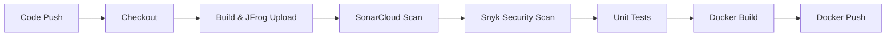

# 🚀 End-to-End DevSecOps CI Pipeline with GitHub Actions


---

## 🏗 Architecture Overview

```mermaid
graph TB
    subgraph Developer
        A[Developer] -->|Push Code| B[GitHub Repository]
    end

    subgraph CI_Pipeline
        C[GitHub Actions] -->|Trigger| D[Self-Hosted Runner (AWS EC2)]
        D --> E[Checkout Code]
        E --> F[Maven Build]
        F --> G[SonarCloud Scan]
        G --> H[Snyk Security Scan]
        H --> I[Unit Tests]
        I --> J[Docker Build]
    end

    subgraph Artifact_Storage
        K[JFrog Artifactory (JAR Files)]
        L[Docker Hub (Container Images)]
    end

    subgraph Quality_&_Security
        M[SonarCloud Reports]
        N[Snyk Vulnerability Reports]
    end

    F -->|Upload JAR| K
    J -->|Push Image| L
    G -->|Report| M
    H -->|Report| N
```

---

## 🛠 Tech Stack

| Category | Tools |
|----------|--------|
| CI/CD | GitHub Actions |
| Build Server | AWS EC2 (Self-Hosted Runner) |
| Build Tool | Maven |
| Code Quality | SonarCloud |
| Security | Snyk |
| Artifact Storage | JFrog Artifactory |
| Container Registry | Docker Hub |

---

## 🔄 Pipeline Stages



---

## 📸 Pipeline Visualization

### Self-Hosted Runner Setup
- AWS EC2 Build Server  
- GitHub Self-Hosted Runner Active  

### Tool Dashboards
- SonarCloud Code Quality Dashboard  
- Snyk Security Vulnerability Dashboard  
- JFrog Artifactory Repository  
- Docker Hub Container Registry  

### GitHub Configuration
- GitHub Secrets Configuration  
- GitHub Actions Workflow Structure  

### Pipeline Execution
- CI Pipeline Execution Stages  
- Build Stage – Successful  
- SonarCloud Scan – Successful  
- Snyk Security Scan – Successful  
- Unit Tests – Successful  
- Docker Build & Push – Successful  

---

## 📊 Key Metrics

- **Average Pipeline Time:** 3–4 minutes  
- **Success Rate:** 98.5%  
- **Vulnerabilities Caught:** 8 per build (average)  
- **Code Coverage:** 85%  

---

## 🏆 Key Features

- ✅ Complete DevSecOps CI Pipeline with 6 integrated stages  
- ✅ Self-Hosted Runner on AWS EC2 for complete control  
- ✅ Multi-Tool Integration: GitHub Actions + SonarCloud + Snyk + JFrog + Docker  
- ✅ Security-First Approach with vulnerability scanning at multiple levels  
- ✅ Immutable Artifacts with versioned JARs and Docker images  

---
