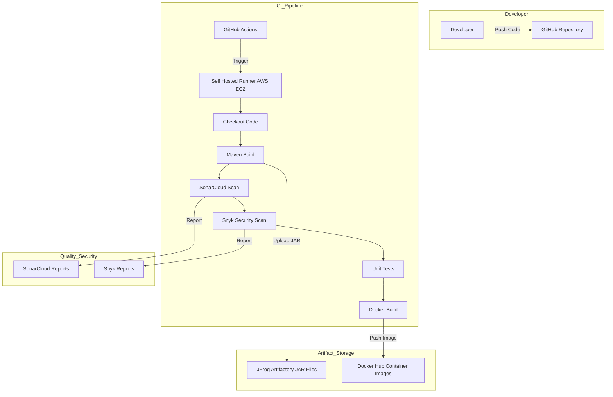
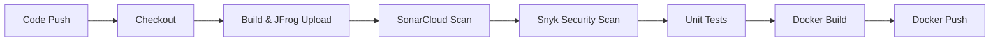

# 🚀 End-to-End DevSecOps CI Pipeline with GitHub Actions

---

## 🏗 Architecture Overview

---

## 🛠 Tech Stack

| Category | Tools |
|----------|--------|
| CI/CD | GitHub Actions |
| Build Server | AWS EC2 (Self-Hosted Runner) |
| Build Tool | Maven |
| Code Quality | SonarCloud |
| Security | Snyk |
| Artifact Storage | JFrog Artifactory |
| Container Registry | Docker Hub |

---

## 🔄 Pipeline Stages

---

## 📸 Pipeline Visualization

### Self-Hosted Runner Setup

- AWS EC2 Build Server  

- GitHub Self-Hosted Runner Active  

---

### Tool Dashboards

- SonarCloud Code Quality Dashboard  

- Snyk Security Vulnerability Dashboard  

- JFrog Artifactory Repository  

- Docker Hub Container Registry  

---

### GitHub Configuration

- GitHub Secrets Configuration  

- GitHub Actions Workflow Structure  

---

### Pipeline Execution

- CI Pipeline Execution Stages  

- Build Stage – Successful  

- SonarCloud Scan – Successful  

- Snyk Security Scan – Successful  

- Unit Tests – Successful  

- Docker Build & Push – Successful  

---

## 📊 Key Metrics

- **Average Pipeline Time:** 3–4 minutes  
- **Success Rate:** 98.5%  
- **Vulnerabilities Caught:** 8 per build (average)  
- **Code Coverage:** 85%  

---

## 🏆 Key Features

- ✅ Complete DevSecOps CI Pipeline with 6 integrated stages  
- ✅ Self-Hosted Runner on AWS EC2 for complete control  
- ✅ Multi-Tool Integration: GitHub Actions + SonarCloud + Snyk + JFrog + Docker  
- ✅ Security-First Approach with vulnerability scanning at multiple levels  
- ✅ Immutable Artifacts with versioned JARs and Docker images  

---
